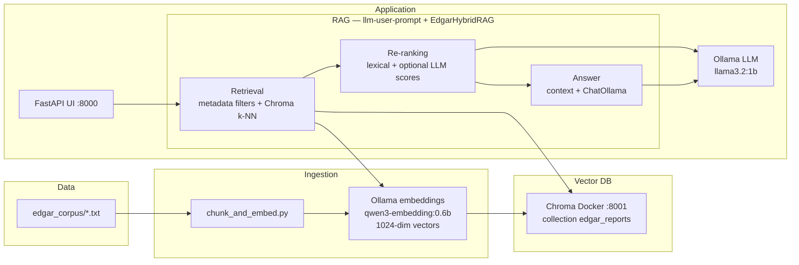

# Gonzalez Sebastian ELIZA submission

SEC EDGAR **10-K / 10-Q** RAG demo: filings are **chunked** and **embedded** into **Chroma**, then the **web UI** asks questions using **hybrid retrieval** (semantic + metadata) and an **Ollama** LLM.

**Python:** 3.10+ (see `.python-version`). **Dependencies:** install from the repo root with [uv](https://docs.astral.sh/uv/):

```bash
uv sync
```

## Prompt log, evaluation notes, and final template

- **Prompt iterations** — [`logs/sys_prompts_log.md`](logs/sys_prompts_log.md): history of system-instruction changes and rationale (assessment deliverable: log of prompt iterations).
- **Quality evaluation** — [`logs/test_questions.md`](logs/test_questions.md): manual test prompts aligned with sample business questions, expected retrieval behavior, and known gaps.
- **Final prompt in code** — [`src/backend/services/rag_prompts.py`](src/backend/services/rag_prompts.py) (`SYSTEM_PROMPT`); the user message wrapper (question + retrieved context) is built in [`src/backend/services/edgar_hybrid_rag.py`](src/backend/services/edgar_hybrid_rag.py) inside `EdgarHybridRAG.answer()`.

---

## How the pieces fit together



**Dependency chain (runtime order):**

1. **Ollama** must be running locally with the **same embedding model** used at ingest time and the **chat model** used for answers. The ingestion script and the RAG stack both call Ollama over HTTP (default base URL for LangChain is local Ollama).
2. **Chroma** (Docker) stores vectors and metadata. Nothing can retrieve until this is up and populated.
3. **`edgar_corpus`** (sibling directory next to this repo root by default) supplies raw `.txt` filings. Without ingestion, the collection is empty.
4. **`chunk_and_embed.py`** reads the corpus, chunks text, embeds via Ollama, and writes to Chroma. Collection name and embedding dimensions must stay aligned with what **RAG** uses (`RAG_COLLECTION`, `RAG_EMBEDDING_MODEL` / defaults).
5. **FastAPI frontend** (`src/frontend/main.py`) serves the Bootstrap chat UI and loads **`llm-user-prompt.py`** by path. That entrypoint adds `src/backend/services` to `sys.path` and wires **`EdgarHybridRAG`** (Chroma + retrieval + optional LLM rerank + **`llama3.2:1b`** generation).

If you change embedding model or dimension, **drop the Chroma collection** and **re-ingest**; mismatch produces Chroma dimension errors at query time.

---

## Ports (avoid clashes)

| Port | Service |
|------|---------|
| **8000** | FastAPI chat UI (`uv run fastapi dev main.py` from `src/frontend`) |
| **8001** | Chroma HTTP API (Docker compose mapping) |
| **11434** | Ollama (default) |

---

## 1. Ollama (embeddings + chat LLM)

Install and start [Ollama](https://ollama.com/) (`ollama serve` if not already a background service).

Pull the models expected by the codebase defaults (adjust if you override env / CLI flags):

```bash
ollama pull qwen3-embedding:0.6b
ollama pull llama3.2:1b
```

**Used by:**

- **`chunk_and_embed.py`** — embedding model (`--embedding-model`, default `qwen3-embedding:0.6b`).
- **RAG pipeline** — same embedding model plus chat model (`RAG_EMBEDDING_MODEL`, `RAG_LLM_MODEL`; see `src/backend/services/rag_config.py`).

---

## 2. Chroma (Docker vector database)

Chroma holds **collections** of chunked filings with **metadata** (ticker, filing date, form type, section, etc.) for hybrid retrieval.

| Item | Value |
|------|------|
| Compose file | `src/backend/database/docker-compose.yaml` |
| Server config | `src/backend/database/chroma.docker.yaml` |
| HTTP API (host) | `http://127.0.0.1:8001` |
| Persistence | Docker volume `chroma_data` → `/data` in the container |

**Start:**

```bash
docker compose -f src/backend/database/docker-compose.yaml up -d
```

**Check:**

```bash
docker compose -f src/backend/database/docker-compose.yaml ps
curl -sS http://127.0.0.1:8001/api/v2/heartbeat
```

**Stop** (keep data):

```bash
docker compose -f src/backend/database/docker-compose.yaml down
```

**Wipe vectors** (destructive):

```bash
docker compose -f src/backend/database/docker-compose.yaml down -v
```

---

## 3. EDGAR corpus (input files)

By default, **`chunk_and_embed.py`** looks for `*_full.txt` under **`edgar_corpus/` at the repository root** (the directory that contains `src/`), i.e. `<repo>/edgar_corpus`. If your filings live elsewhere (for example a sibling folder outside the repo), pass **`--corpus-dir`** explicitly.

---

## 4. Ingestion (`chunk_and_embed.py`)

**Purpose:** chunk `.txt` filings → embed with Ollama → upsert into Chroma (batched; optional skip of existing IDs).

**Run from repo root** (examples):

```bash
# Dry run (no Chroma writes)
uv run python src/backend/data_processing/chunk_and_embed.py --dry-run --limit-files 3

# Full ingest (tune batch size if needed)
uv run python src/backend/data_processing/chunk_and_embed.py \
  --glob "*_full.txt" \
  --batch-size 32 \
  --chroma-host 127.0.0.1 \
  --chroma-port 8001 \
  --collection edgar_reports
```

**Requires:** Ollama up, Chroma up, corpus path correct. **`--embedding-model`** must match what you use at retrieval time.

Flags of note: `--skip-existing`, `--limit-files`, `--collection`, `--chroma-host`, `--chroma-port`.

---

## 5. Web UI (FastAPI)

**Purpose:** browser chat form → **`POST /chat`** → hybrid RAG (`EdgarHybridRAG.answer`) → HTML response with answer and sources.

**Run** (typical dev):

```bash
cd src/frontend
uv run fastapi dev main.py
```

Open **`http://127.0.0.1:8000`**.

**Requires:** Ollama, Chroma, and a **non-empty** collection compatible with the configured embedding model. The app dynamically imports **`src/backend/services/llm-user-prompt.py`** (which patches `sys.path` so sibling service modules load).

**Timeouts:** optional env **`RAG_HTTP_TIMEOUT`** (seconds) read by `main.py` when calling the RAG pipeline.

---

## 6. RAG service configuration (environment variables)

Runtime tuning lives in **`src/backend/services/rag_config.py`** (`RAGConfig.from_env()`). Common variables:

| Variable | Role |
|----------|------|
| `RAG_COLLECTION` | Chroma collection name (must match ingest `--collection`) |
| `RAG_CHROMA_HOST` / `RAG_CHROMA_PORT` | Chroma HTTP endpoint |
| `RAG_EMBEDDING_MODEL` | Ollama embedding model (**must match ingestion**) |
| `RAG_LLM_MODEL` | Ollama chat model |
| `RAG_SEMANTIC_K` / `RAG_FINAL_K` / `RAG_METADATA_K` | Retrieval breadth |
| `RAG_NUM_CTX` / `RAG_NUM_PREDICT` / `RAG_MAX_CONTEXT_CHARS` | Context window budgeting |
| `RAG_USE_RERANKER` | Optional LLM-based reranking |
| `RAG_HTTP_TIMEOUT` | UI threadpool wait for full RAG answer (frontend) |

After changing env vars, restart the FastAPI process so **`lru_cache`** reloads the RAG singleton.

**CLI smoke test** (no browser):

```bash
uv run python src/backend/services/llm-user-prompt.py --query "Summarize risk factors for TSLA."
```

---

## Suggested first-time startup sequence

1. `uv sync`
2. Start **Ollama**; pull **`qwen3-embedding:0.6b`** and **`llama3.2:1b`**
3. `docker compose -f src/backend/database/docker-compose.yaml up -d`
4. Run **`chunk_and_embed.py`** (without `--dry-run`) to populate **`edgar_reports`** (or your chosen collection)
5. `cd src/frontend && uv run fastapi dev main.py`
6. Open **`http://127.0.0.1:8000`** and submit a prompt

---

## Optional: service module layout

RAG logic is split under **`src/backend/services/`** for readability:

| Module | Responsibility |
|--------|----------------|
| `llm-user-prompt.py` | CLI entry, `sys.path` bootstrap, re-exports |
| `edgar_hybrid_rag.py` | Chroma retrieval, fusion, orchestration |
| `rag_config.py` | `RAGConfig` + env parsing |
| `rag_reranking.py` | Lexical/metadata scores + recency reranking |
| `rag_context.py` | Prompt context packing |
| `rag_prompts.py` | System prompt text (see also [`logs/sys_prompts_log.md`](logs/sys_prompts_log.md)) |
| `edgar_query_patterns.py` | Regex helpers + metadata filters |

Manual QA prompts and observations: [`logs/test_questions.md`](logs/test_questions.md).

---

## Chroma development note

`chroma.docker.yaml` sets **`allow_reset: true`** for easier resets during development; set to **`false`** if you want to disallow reset operations from clients.
